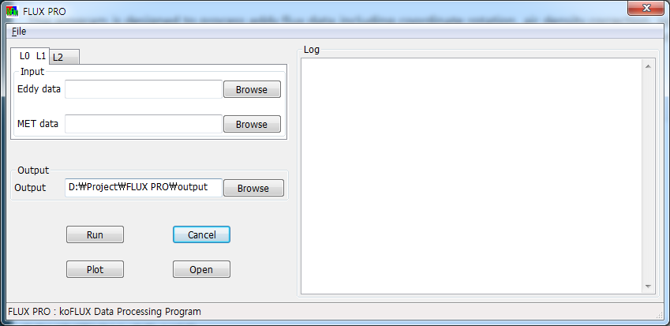
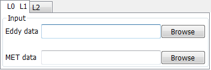
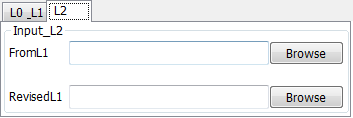
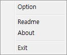
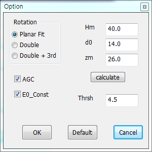
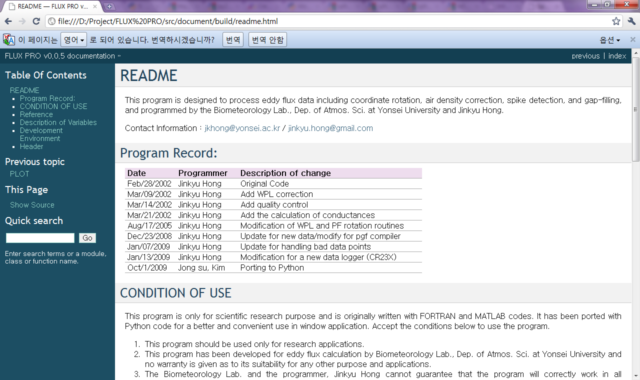
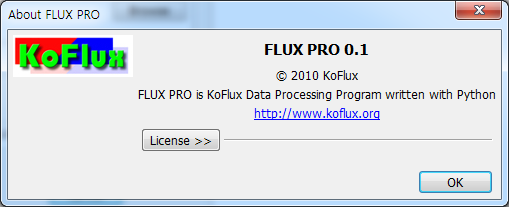

Manual
========
MAIN WINDOW
-------------

* Run 	 : 프로그램을 돌린다.
* Cancel : 수행중인 프로그램을 취소한다.(Abort)
* Plot	 : 그래프를 그린다.
* Open	 : 프로그램 실행파일이 있는 폴더를 연다.
	
Input File Form
^^^^^^^^^^^^^^^

* L0 L1가 활성화 되면, L0와 L1에 관한 프로그램(연산 및 그래프 그리기)를 수행한다.
* L2가 활성화 되면, L2에 관한 프로그램(연산 및 그래프 그리기)를 수행한다.

MENU
----

Option window
^^^^^^^^^^^^^

	
* Rotation 	        : L0에서의 Rotation 종류
* AGC 				: L0에서의 AGC 값을 포함시킬지 여부
* E0_const 			: L2에서의 E0_const 의 True/False
* Hm, d0, zm 		: L0에서의 zm = Hm - d0
* calculate 버튼 	: zm = Hm - d0를 계산한다.
* Thrsh				: L0에서의 Threshold값

Readme
^^^^^^

* :ref:`Readme <README>` 파일을 연다.

About
^^^^^

* 프로그램 정보를 연다.

Exit	
^^^^

* 프로그램을 종료한다.
